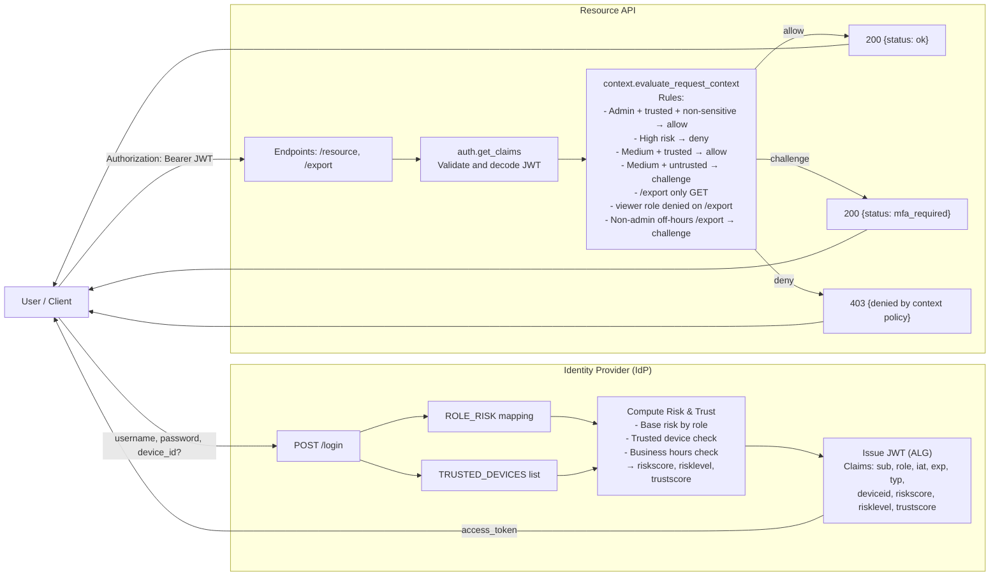
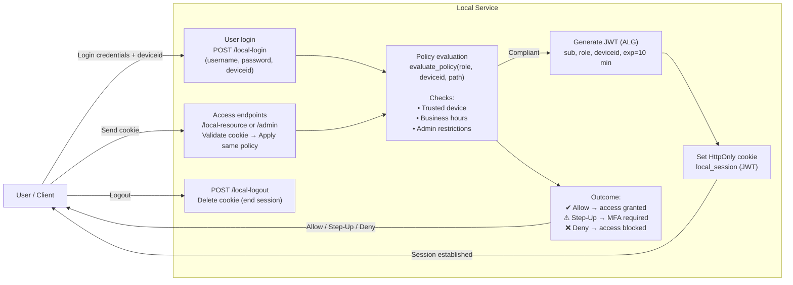

# 🔐 Zero Trust Authentication – Extended Prototype Group-B

[](https://www.python.org/)
[](https://fastapi.tiangolo.com/)
[](https://www.docker.com/)
[](LICENSE)

---

## 💡 Overview

This repository demonstrates the implementation of **Zero Trust Authentication** concepts within a distributed system architecture.
It extends a baseline system consisting of:

* **IdP (Identity Provider)**
* **Resource API**
* **Local Service**

The updated architecture focuses on **continuous verification** and **context-based access decisions** rather than static perimeter trust.

---

## 🧩 New Architecture Overview

The following diagram illustrates the extended Zero Trust architecture with all three services (IdP, Resource API, Local Service):


### 🔑 IdP + Resource API



### 🔑 Local Service




---

## ⚙️ Zero Trust Extensions

Our implementation expands the baseline architecture with additional **Zero Trust mechanisms**:

| Area                  | Extension                                             | Description                                                                 |
| --------------------- | ----------------------------------------------------- | --------------------------------------------------------------------------- |
| **Policy Evaluation** | Introduced in both `resource_api` and `local_service` | Each request is dynamically checked based on user role, device, and context |
| **Contextual Checks** | Business hours, trusted devices, admin-only endpoints | Access is granted, challenged (step-up), or denied dynamically              |
| **Session Security**  | JWT stored in secure cookie                           | Enables short-lived local sessions with continuous verification             |
| **JWT Handling**      | Encrypted using configured `ALG` algorithm            | Tokens include contextual claims (role, device, type, expiry)               |

---

## 🚀 Run Instructions

### 1. Clone the repository

```bash
git clone https://github.com/gomec1/zt-starter-Group-B.git
cd zt-starter-Group-B
```

### 2. Build and start the environment

```bash
docker compose up --build
```

### 3. Test the authentication flow
#### 3.1 idp + resource api
```bash
make test-curl
```
#### 3.2 local service

Login options:

Username: local , Password: local  
Username: admin , Password: admin

TRUSTED_DEVICES = ["lab-1", "lab-2", "office-pc"]  
ADMIN_TRUSTED_DEVICES = ["lab-1"]

JSON Example for Login with FastAPI Website

```bash
{
  "username": "local",
  "password": "local",
  "deviceid": "office-pc"
}
```

```bash
{
  "username": "admin",
  "password": "admin",
  "deviceid": "lab-1"
}
```

Expected result:

* IdP issues a signed JWT
* Resource API and Local Service evaluate context before granting access

---

## 🧪 Test via Browser (Swagger UI)

Once Docker is running, you can access and test all APIs through their **interactive FastAPI documentation**:

| Service           | URL                                                      |
| ----------------- | -------------------------------------------------------- |
| **IdP Service**   | [http://localhost:8001/docs](http://localhost:8001/docs) |
| **Resource API**  | [http://localhost:8002/docs](http://localhost:8002/docs) |
| **Local Service** | [http://localhost:8003/docs](http://localhost:8003/docs) |

Each service provides testable endpoints for login, token verification, and local session handling.

---

## 📦 Repository Structure

```
zt-zero-trust-auth/
│-- docs/
│   ├── NOCH EINFügen XXXXXX
│-- idp/
│   ├── app.py
│   ├── Dockerfile
│   ├── .env
│-- resource_api/
│   ├── app.py
│   ├── context.py
│   ├── auth.py
│   ├── Dockerfile
│   ├── .env
│-- local_service/
│   ├── app.py
│   ├── Dockerfile
│   ├── .env
│-- .env
│-- .gitignore
│-- docker-compose.yml
│-- Makefile
│-- README.md
│-- requirements.txt
```

---

## 🏁 Summary

| Component             | Description                                                  |
| --------------------- | ------------------------------------------------------------ |
| **IdP**               | Centralised authentication issuing signed JWTs               |
| **Resource API**      | Context-aware policy enforcement and JWT verification        |
| **Local Service**     | Independent local authentication with dynamic access control |
| **Policy Evaluation** | Core element ensuring Zero Trust decision-making             |
| **Docker Compose**    | Runs all components in isolated containers                   |

---

## 🧾 License

This project is released under the **MIT License**
and was developed for the
**BFH – Software Design & Architecture (SDA4) module.**

---

✅ *This extended version demonstrates the shift from static credential-based access to dynamic, context-driven Zero Trust enforcement across distributed services.*
